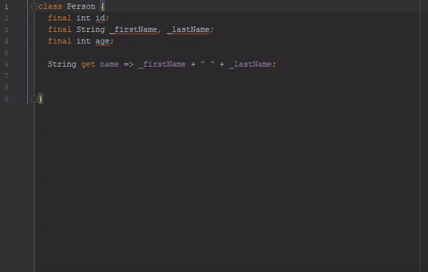
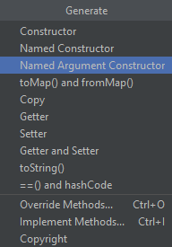
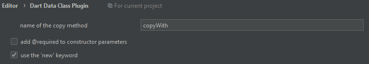

*Issue tracker repository for the IntelliJ plugin [`Dart Data Class`](https://plugins.jetbrains.com/plugin/12429-dart-data-class)*

---

# Dart Data Class Plugin



This plugin is created for those who would like to have extra data manipulation methods in their data classes without having to write boilerplate code.



This plugin can generate the following code:
- Named Argument Constructor
- `copyWith`: copies the instance and overrides the given parameters
- `toMap`: converts your class into a map of `Map<String, dynamic>`
- `fromMap`: constructs your class from a `Map<String, dynamic>` using the named argument constructor
- all of the above with `toString`, `equals` (`==` operator), `hashcode`

## Example

Let's say you have a class called `Person` with the properties:

```dart
class Person {
  final int id;
  final String _firstName, _lastName;
  final int age;

  String get name => _firstName + " " + _lastName;
}
```

A possible generation may look like this

*(Note that some features of this generation can be customized, see details below.)*


```dart
class Person {
  final int id;
  final String _firstName, _lastName;
  final int age;

  String get name => _firstName + " " + _lastName;

//<editor-fold desc="Data Methods" defaultstate="collapsed">

  const Person({
    @required this.id,
    @required this.age,
    @required String firstName,
    @required String lastName,
  })  : _firstName = firstName,
        _lastName = lastName;

  Person copyWith({
    int id,
    String firstName,
    String lastName,
    int age,
  }) {
    if ((id == null || identical(id, this.id)) &&
        (firstName == null || identical(firstName, this._firstName)) &&
        (lastName == null || identical(lastName, this._lastName)) &&
        (age == null || identical(age, this.age))) {
      return this;
    }

    return Person(
      id: id ?? this.id,
      firstName: firstName ?? this._firstName,
      lastName: lastName ?? this._lastName,
      age: age ?? this.age,
    );
  }

  @override
  String toString() {
    return 'Person{id: $id, _firstName: $_firstName, _lastName: $_lastName, age: $age}';
  }

  @override
  bool operator ==(Object other) =>
      identical(this, other) ||
      (other is Person &&
          runtimeType == other.runtimeType &&
          id == other.id &&
          _firstName == other._firstName &&
          _lastName == other._lastName &&
          age == other.age);

  @override
  int get hashCode =>
      id.hashCode ^ _firstName.hashCode ^ _lastName.hashCode ^ age.hashCode;

  factory Person.fromMap(Map<String, dynamic> map) {
    return Person(
      id: map['id'] as int,
      firstName: map['_firstName'] as String,
      lastName: map['_lastName'] as String,
      age: map['age'] as int,
    );
  }

  Map<String, dynamic> toMap() {
    // ignore: unnecessary_cast
    return {
      'id': this.id,
      '_firstName': this._firstName,
      '_lastName': this._lastName,
      'age': this.age,
    } as Map<String, dynamic>;
  }

//</editor-fold>

}
```
## Settings



You can find additional settings under `Settings` > `Editor` > `Dart Data Class Plugin` where you have the following customization options:

- set the name of the copy method
- use `@required` annotation
- use `new` keyword when instantiation
- use the `const` keyword for the constructor generation - all fields in the class have to be final
- copy function can be specified to return the same instance. This Option has the same requirement as the const keyword. Useful when using Dart in a Redux architecture.
- key mapper for `toMap` and `fromMap` - use your own logic to transform the keys to their original values - useful when database result returns prefixed or uppercased result
- `no implicit casts` fixes the `missing type arguments` error if you have your lint rules configured that way


#### Under the hood

This project is built using Kotlin and makes use of IntelliJ's PSI elements for extracting the structure of the Dart file of your selection.
